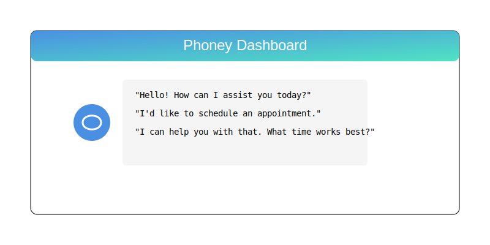

<div align="center">


# 🎭 PHONEY

### Your AI Phone Assistant with a Personality

[](https://nextjs.org/)
[](https://www.typescriptlang.org/)
[](https://openai.com/)
[](https://www.twilio.com/)
[](LICENSE)

</div>

<div align="center">
  <h3>🎭 Give Your Phone Line a Personality 🎭</h3>
  <h4>Transform your phone system with an AI assistant that's more than just a voice - it's a character!</h4>
</div>

---

<p align="center">
  <a href="#-features">Features</a> •
  <a href="#-quick-start">Quick Start</a> •
  <a href="#-demo">Demo</a> •
  <a href="#-documentation">Documentation</a> •
  <a href="#-contributing">Contributing</a>
</p>

---

## 🌟 Features

<div align="center">
  <table>
    <tr>
      <td align="center">🎭 <b>Personality AI</b></td>
      <td align="center">🎯 <b>Smart Routing</b></td>
      <td align="center">🔄 <b>Real-time</b></td>
      <td align="center">🎛️ <b>Control</b></td>
    </tr>
    <tr>
      <td>Custom AI personas for your business</td>
      <td>Intelligent call handling & forwarding</td>
      <td>Live transcription & monitoring</td>
      <td>Instant human takeover capability</td>
    </tr>
  </table>
</div>

## 🚀 Quick Start

```bash
# Clone the repo
git clone https://github.com/Shawn5cents/Phoney.git

# Install dependencies
npm install

# Set up environment
cp .env.example .env

# Launch
npm run dev
```

## 🎮 Demo

<div align="center">
  
</div>

## 🛠️ Tech Stack

<div align="center">
  <table>
    <tr>
      <td align="center"><b>Frontend</b></td>
      <td align="center"><b>Backend</b></td>
      <td align="center"><b>AI/ML</b></td>
      <td align="center"><b>Infrastructure</b></td>
    </tr>
    <tr>
      <td>
        • Next.js 14<br>
        • TypeScript<br>
        • Tailwind CSS
      </td>
      <td>
        • Next.js API Routes<br>
        • Twilio SDK<br>
        • Pusher
      </td>
      <td>
        • OpenAI GPT-4<br>
        • ElevenLabs Voice<br>
        • Custom ML Models
      </td>
      <td>
        • Vercel/Railway<br>
        • PostgreSQL<br>
        • Redis Cache
      </td>
    </tr>
  </table>
</div>

## 📚 Documentation

- [Getting Started Guide](https://shawn5cents.github.io/Phoney/getting-started)
- [API Reference](https://shawn5cents.github.io/Phoney/api-reference)
- [Architecture Overview](https://shawn5cents.github.io/Phoney/architecture)
- [Deployment Guide](https://shawn5cents.github.io/Phoney/deployment)

## 🤝 Contributing

We welcome contributions! Check out our [Contributing Guide](https://shawn5cents.github.io/Phoney/contributing) to get started.

## 📄 License

This project is licensed under the MIT License - see the [LICENSE](LICENSE) file for details.

<div align="center">

### Made with ❤️ by [Shawn5cents](https://github.com/Shawn5cents)

<a href="https://github.com/Shawn5cents/Phoney/stargazers">⭐ Star us on GitHub!</a>

</div>
