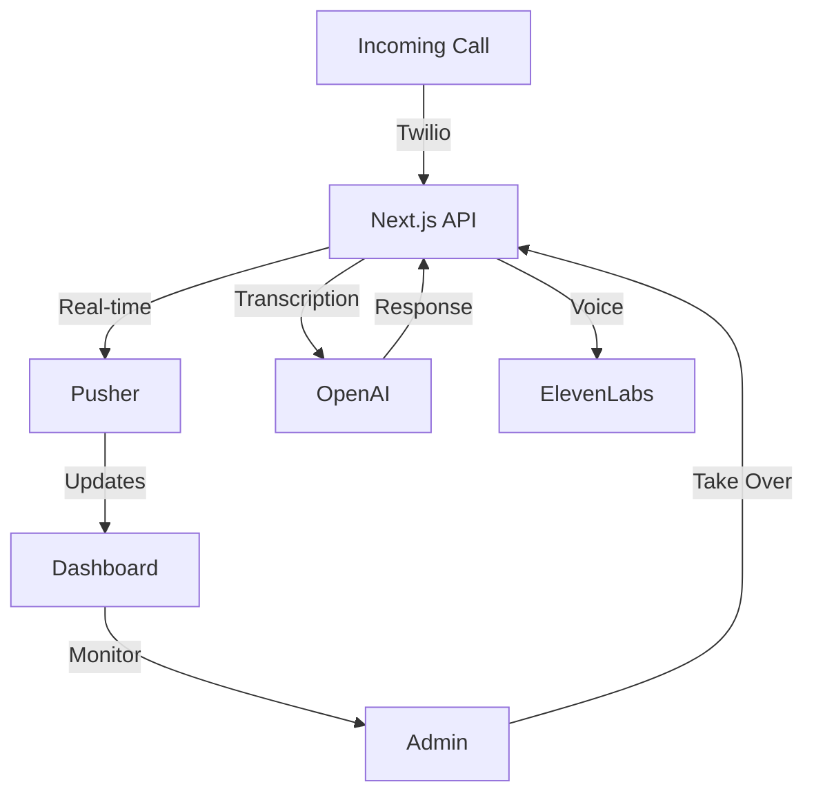

# 🏗️ Phoney Architecture

## System Overview



## 🔍 Core Components

### 1. Call Handler
- Location: `/app/api/incoming-call`
- Handles incoming Twilio webhooks
- Initiates call flow
- Manages call state

### 2. Speech Processor
- Location: `/app/api/process-speech`
- Converts speech to text
- Sends to OpenAI for processing
- Returns AI response

### 3. Call Monitor
- Location: `/app/api/take-over-call`
- Enables human intervention
- Real-time call status
- Call control actions

## 🔄 Data Flow

1. **Call Initiation**
   ```
   User Call -> Twilio -> API -> Pusher -> Dashboard
   ```

2. **Speech Processing**
   ```
   Audio Stream -> OpenAI -> GPT-4 -> ElevenLabs -> Audio Response
   ```

3. **Monitoring Flow**
   ```
   Call Events -> Pusher -> Dashboard -> Admin Interface
   ```

## 🏢 Tech Stack Details

### Frontend
- Next.js 14
- React 18
- Tailwind CSS
- TypeScript
- Pusher.js

### Backend
- Next.js API Routes
- OpenAI GPT-4
- ElevenLabs API
- Twilio SDK
- Pusher Server

## 📦 State Management

- Call state in Redis
- Real-time updates via Pusher
- Session management with Next.js

## 🔒 Security

- API Authentication
- Rate Limiting
- Input Validation
- Secure Webhooks
- Encrypted Storage

## 🔌 Integration Points

1. **Twilio Integration**
   - Webhook Configuration
   - Voice Handling
   - Call Control

2. **OpenAI Integration**
   - GPT-4 API
   - Context Management
   - Response Filtering

3. **ElevenLabs Integration**
   - Voice Generation
   - Audio Streaming
   - Voice Customization

## 📈 Scaling Considerations

- Horizontal Scaling
- Load Balancing
- Caching Strategy
- Rate Limiting
- Error Handling
