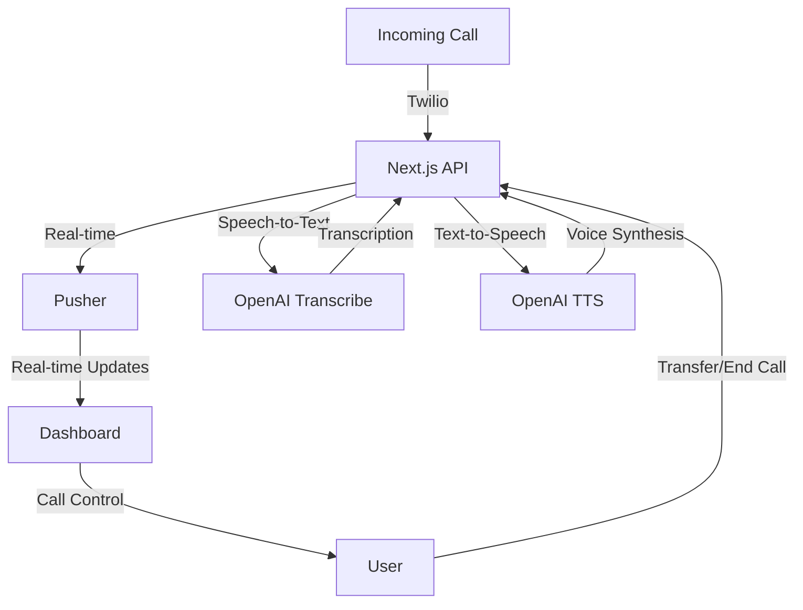
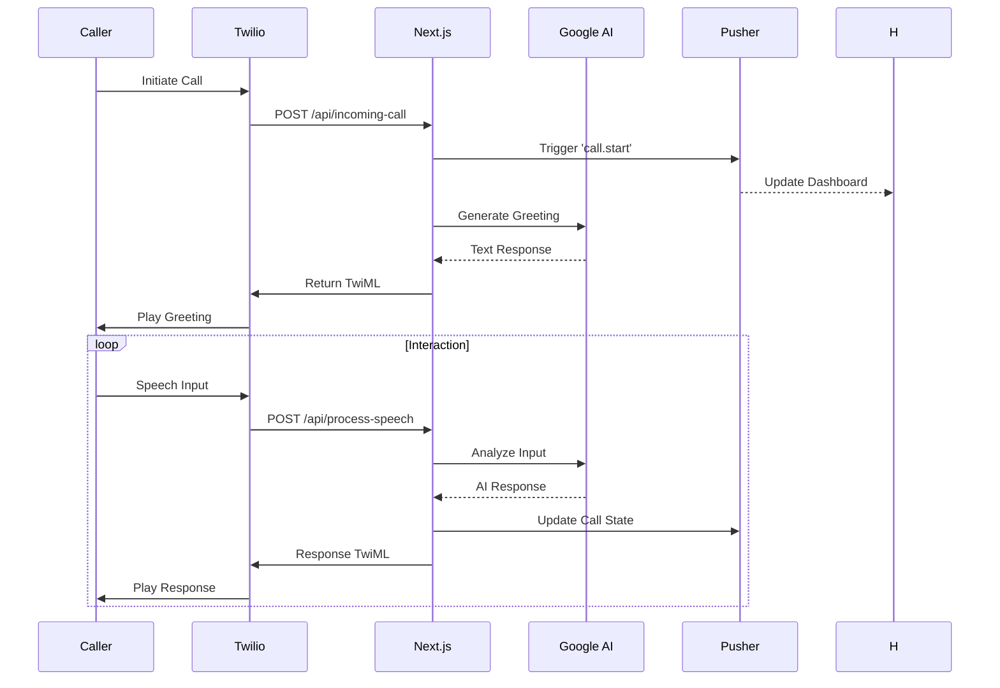
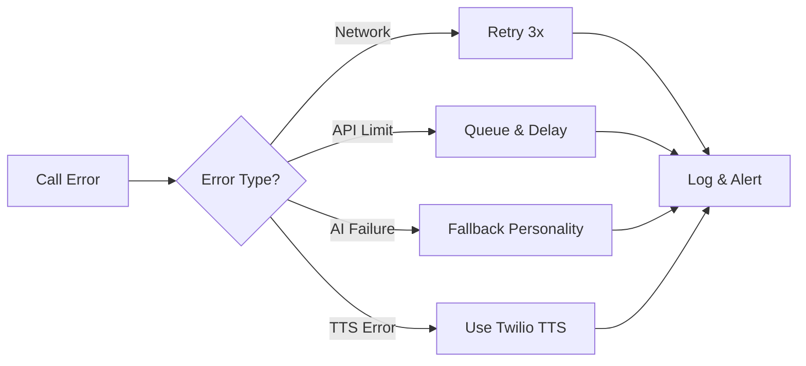

# 🏗️ Phoney Architecture

## System Overview



## 🔍 Core Components

### 1. Call Handler
- Location: `/app/api/incoming-call`
- Handles incoming Twilio webhooks
- Initiates call flow with TwiML
- Notifies dashboard via Pusher

### 2. Speech Processor
- Location: `/app/api/process-speech`
- Processes speech from Twilio
- Streams to Google Gemini for AI responses
- Generates voice using Google TTS

### 3. No-Input Handler
- Location: `/app/api/no-input`
- Handles cases when no speech is detected
- Provides follow-up prompts
- Ensures smooth conversation flow

### 4. Call Transfer
- Location: `/app/api/transfer-call`
- Enables call transfers to other numbers
- Uses Twilio's TwiML for call control
- Updates call status in real-time

## 🔄 Data Flow

1. **Call Initiation**
   ```
   User Call -> Twilio -> incoming-call API -> Pusher Channels -> Dashboard
   ```

2. **Speech Processing**
   ```
   Twilio Speech Recognition -> process-speech API -> Gemini AI -> Google TTS -> Twilio Response
   ```

3. **Real-time Updates**
   ```
   Call Events -> Pusher Channels -> Dashboard -> Partial Response Updates
   ```

4. **Call Transfer**
   ```
   Dashboard Action -> transfer-call API -> Twilio TwiML -> Call Transfer
   ```

## 🏢 Tech Stack Details

### Frontend
- Next.js 14
- React 18
- Tailwind CSS
- TypeScript
- Pusher.js Client with WebSockets

### Backend
- Next.js API Routes
- OpenAI API (speech-to-text and text-to-speech)
- Twilio SDK with TwiML
- Pusher Server for real-time updates

## 📦 State Management

- Call state managed through Pusher channels
- Channel-based subscriptions (`calls` and `call-${callId}`)
- Real-time state synchronization
- Dashboard state persistence with React

## 🔒 Security

- API Authentication
- Rate Limiting
- Input Validation
- Secure Webhooks
- Encrypted Storage

## 🔌 Integration Points

1. **Twilio Integration**
   - Webhook Configuration (/api/incoming-call)
   - Speech Recognition (gather verb)
   - TwiML for Call Control
   - Call Transfers

2. **Google Gemini Integration**
   - Streaming AI Responses
   - Multiple AI Personalities
   - Context Management
   - Response Optimization

3. **Google TTS Integration**
   - Voice Generation
   - Voice Selection by Personality
   - Audio Streaming to Twilio
   - Voice Customization

4. **Pusher Integration**
   - Channel Authentication
   - Real-time Event Broadcasting
   - Client-side Event Handling
   - WebSocket Connections

## 📈 Scaling Considerations

- Horizontal Scaling on Railway
- Speech Cache Initialization
- Error Handling with Fallbacks
- Real-time Connection Management
- Call Volume Optimization
- Pusher Channel Limits

## 🎭 Personality System

The application features multiple AI personalities, each with distinct characteristics:

### Professional
- Formal business tone
- Clear and concise responses
- Optimized for business calls

### Friendly
- Warm and approachable
- Casual but helpful tone
- Natural conversation style

### Witty
- Clever responses with humor
- Engaging and entertaining
- Maintains professionalism

### Zen
- Calm and thoughtful
- Mindful communication
- Peaceful conversation style

Each personality has its own:
- System prompt
- Voice settings
- Example interactions
- Response style

## 🚀 Enhanced Architecture Analysis

### AI Response Generation Flow


### Personality Configuration Details
```typescript
// From lib/ai-personalities.ts
export interface AIPersonality {
  name: string;
  description: string;
  systemPrompt: string;
  voiceId: string;
  traits: string[];
  examples: {
    input: string;
    response: string;
  }[];
}
```

### Real-Time Call Handling Metrics
| Metric                | Target Value       | Monitoring Method       |
|-----------------------|--------------------|-------------------------|
| Call Answer Time      | <2 seconds         | Twilio Insights         |
| AI Response Latency   | <1.5 seconds       | Custom Performance Mark |
| Speech Recognition    | >95% accuracy      | Google Speech API       |
| Real-time Update Delay| <200ms             | Pusher Webhooks         |

## 🛠️ Error Handling Strategy


## 🔮 Future Enhancement Pipeline
1. Personality Blending Engine
2. Multi-language Support Matrix
3. Call Sentiment Analysis Integration
4. Visual Call Flow Editor
5. Enterprise SSO Integration
